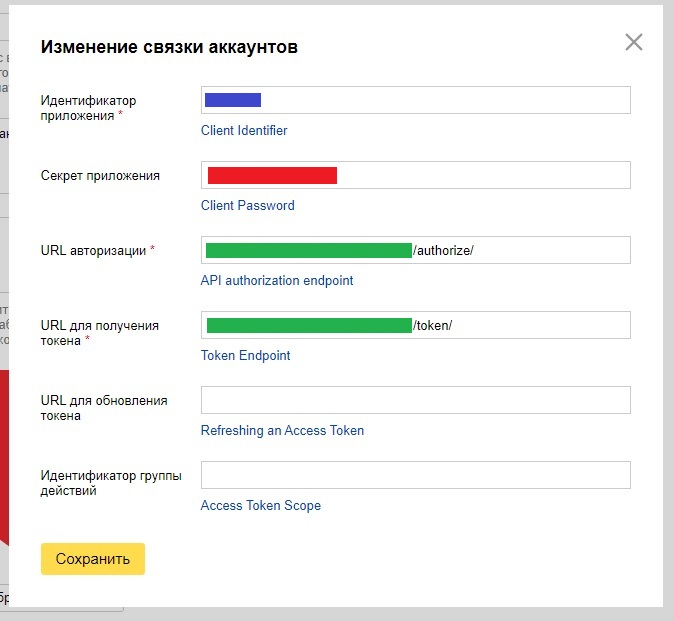
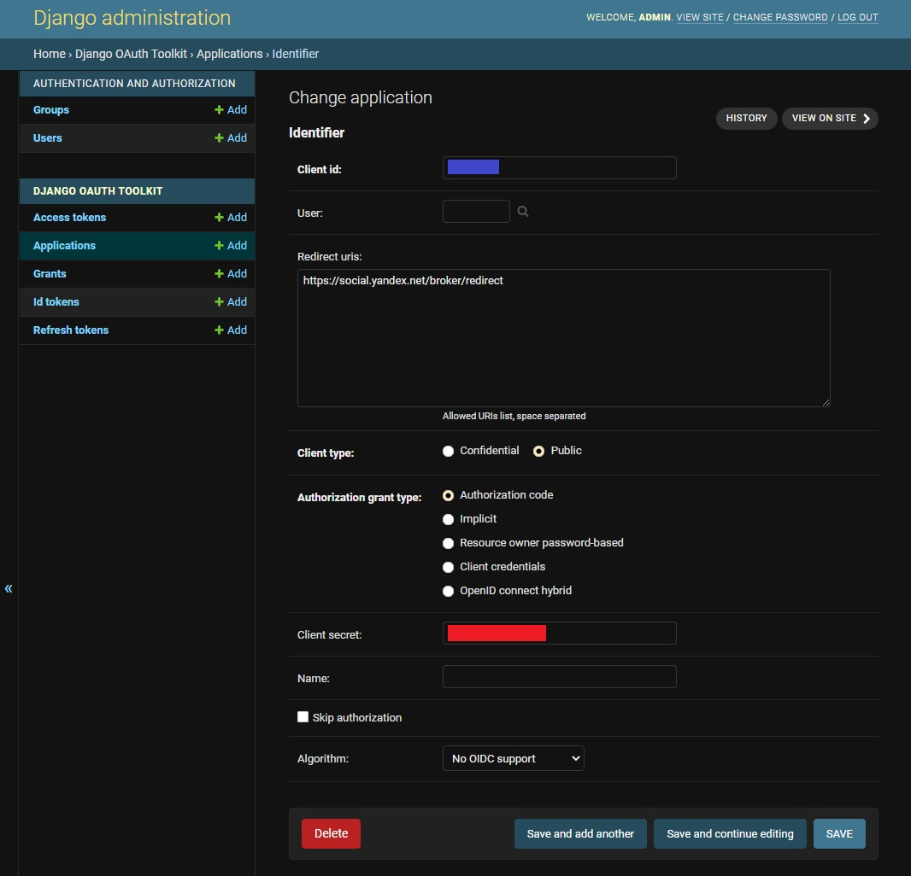

# DjangoAliceHome
Skill for Yandex Smart Home on Django | Навык для Умного дома Яндекса на Django

Ссылка на создание далога - https://dialogs.yandex.ru/developer/

Ссылка на описание API умного дома - https://yandex.ru/dev/dialogs/smart-home/doc/reference/resources.html

